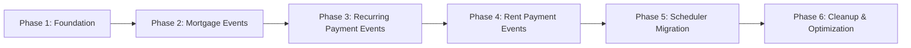

# ImmoPi: Event-Driven Architecture Refactoring Plan

**Project:** ImmoPi - Migration from Batch-Oriented to Event-Driven Architecture  
**Created:** 2025-08-01  
**Priority:** P0 (Critical)  
**Status:** Planning Phase

---

## 🎯 Executive Summary

### Current State
- **Mortgage Automation**: Runs once per month via scheduler (daily at 1 AM), or manually via API call
- **Recurring Payments Automation**: Runs via scheduler (daily at 1 AM)
- **Rent Payments Automation**: Runs via scheduler (daily at 1 AM Europe/Berlin)
- **No automatic triggers** when properties/contracts/payments are created/updated
- **Manual dashboard refresh** required to see updates

### Desired State
- **Purely event-driven**: Actions trigger immediately when data changes
- **Minimal batch processing**: Only as fallback/safety net
- **Real-time automation**: Each entity triggers relevant automation on create/update
- **Maintained functionality**: Dashboard refresh button still works but becomes less critical
- **Schedulers**: Kept as fallback mechanism or removed

---

## 🏗️ Architecture Overview

### Current Architecture (Batch-Oriented)
```
┌─────────────────┐     ┌─────────────────┐     ┌─────────────────┐
│  Scheduler       │────▶│  Automation      │────▶│  Database        │
│  (node-cron)     │     │  Scripts         │     │  (SQLite)        │
└─────────────────┘     └─────────────────┘     └─────────────────┘
         │                        │                        │
         │ Manual Trigger         │ Batch Processing       │
         ▼                        ▼                        ▼
┌─────────────────┐     ┌─────────────────┐     ┌─────────────────┐
│  API Endpoint    │     │  Process All     │     │  Check for       │
│  /api/automation/│     │  Properties/     │     │  Duplicates      │
│  run-rent        │     │  Contracts       │     │  & Create        │
└─────────────────┘     └─────────────────┘     └─────────────────┘
```

### Target Architecture (Event-Driven)
```
┌─────────────────┐     ┌─────────────────┐     ┌─────────────────┐
│  API Endpoint    │────▶│  Event Handler   │────▶│  Automation      │
│  (POST/PUT)      │     │  (Inline)        │     │  Functions       │
└─────────────────┘     └─────────────────┘     └─────────────────┘
         │                        │                        │
         │ Create/Update          │ Trigger on            │ Create          │
         ▼                        ▼                        ▼
┌─────────────────┐     ┌─────────────────┐     ┌─────────────────┐
│  Database        │     │  Immediate        │     │  Transactions/   │
│  (SQLite)        │     │  Automation      │     │  Payments        │
└─────────────────┘     └─────────────────┘     └─────────────────┘
         │                        │                        │
         │                        ▼                        │
         │               ┌─────────────────┐                │
         │               │  Scheduler       │                │
         │               │  (Fallback)      │                │
         └──────────────▶│  Batch Run       │◀───────────────┘
                            └─────────────────┘
```

### Key Changes
1. **Event Triggers**: Automation runs immediately on entity create/update
2. **Idempotency**: Functions check for duplicates before creating
3. **Fallback Scheduler**: Runs periodically to catch missed events
4. **No Breaking Changes**: Existing API endpoints remain functional

---

## 📋 Requirements Analysis

### Functional Requirements
- [ ] Mortgage transactions: Create immediately when property with mortgage is created/updated
- [ ] Recurring payments: Create immediately when recurring payment is created/updated
- [ ] Rent payments: Create immediately when tenant contract is created/updated
- [ ] Dashboard refresh button: Still works but becomes secondary
- [ ] Schedulers: Kept as fallback or can be removed

### Non-Functional Requirements
- [ ] **Zero Downtime**: Existing functionality must not break
- [ ] **Idempotency**: Multiple triggers should not create duplicates
- [ ] **Rollback Capability**: Each phase can be rolled back independently
- [ ] **Minimal Risk**: Changes are incremental and testable
- [ ] **Performance**: Event-driven should be faster than batch for single updates

### Constraints
- [ ] Single database (SQLite)
- [ ] Node.js backend with Express
- [ ] Existing API endpoints must remain compatible
- [ ] No frontend changes required
- [ ] Existing data must not be corrupted

---

## 📊 Entity-Trigger Mapping

### Trigger Points by Entity

| Entity | Create Trigger | Update Trigger | Automation to Run |
|--------|---------------|----------------|-------------------|
| Property | ✅ Yes | ✅ Yes (if mortgage data changes) | Mortgage transactions |
| Tenant Contract | ✅ Yes | ✅ Yes (if payment terms change) | Rent payments + transactions |
| Recurring Payment | ✅ Yes | ✅ Yes (if amount/frequency changes) | Recurring payment transactions |
| Rent Payment | ❌ No | ❌ No | N/A (manual override) |
| Transaction | ❌ No | ❌ No | N/A (already created) |

### Automation Logic by Trigger

#### Property Events
```
Trigger: POST/PUT /api/properties
  ├─ If property.mortgage exists
  │   ├─ If create: Generate all mortgage transactions from startDate to today
  │   └─ If update: Only generate new transactions for changed mortgage data
  └─ Call: processPropertyMortgage(property)
```

#### Tenant Contract Events
```
Trigger: POST/PUT /api/tenant-contracts
  ├─ If create: Generate all rent payments from firstPaymentDate to today
  │   └─ Also create linked transactions for each payment
  ├─ If update: Only generate new payments for changed contract terms
  └─ Call: processTenantContract(contract)
```

#### Recurring Payment Events
```
Trigger: POST/PUT /api/recurring-payments
  ├─ If create: Generate all transactions from startDate to today
  │   └─ Backfill past due dates
  ├─ If update: Only generate new transactions for changed parameters
  └─ Call: processRecurringPayment(recurringPayment)
```

---

## 🎯 Implementation Phases

### Phase Overview



### Phase 1: Foundation & Infrastructure

**Goal**: Establish the infrastructure for event-driven automation without changing existing behavior.

**Duration**: 1-2 days

**Tasks**:

- [ ] **Create event-detection utility module**
  - Create `server/event-detector.js` with helper functions
  - Detect if mortgage data changed in property update
  - Detect if payment terms changed in contract update
  - Detect if recurring payment parameters changed
  - **File**: `server/event-detector.js` (New)
  - **Effort**: M | **Priority**: P0

- [ ] **Create idempotency helper module**
  - Create `server/idempotency.js` with duplicate prevention functions
  - Reusable `checkTransactionExists(description, date, amount, propertyId)`
  - Reusable `checkRentPaymentExists(contractId, date)`
  - **File**: `server/idempotency.js` (New)
  - **Effort**: M | **Priority**: P0

- [ ] **Extract shared automation utilities**
  - Move common date utilities to shared module
  - Extract duplicate checking logic from mortgage/rent/recurring modules
  - Create reusable `isAutoGeneratedTransaction(description)` function
  - **File**: `server/automation-utils.js` (New)
  - **Effort**: M | **Priority**: P0

- [ ] **Add logging for event-driven actions**
  - Extend existing logging to track event-driven vs batch triggers
  - Add `source: 'event-driven'` or `source: 'batch'` to log entries
  - Update all automation modules to include source in logs
  - **Files**: `server/rent-automation.js`, `server/mortgage-automation.js`, `server/recurring-automation.js`
  - **Effort**: S | **Priority**: P1

- [ ] **Create integration test framework**
  - Create test scripts to verify event-driven automation
  - Test create/update scenarios for each entity
  - Verify no duplicates created
  - **File**: `server/tests/event-driven.test.js` (New)
  - **Effort**: M | **Priority**: P1

**Expected Outcomes**:
- New utility modules ready for use
- Common functionality extracted and reusable
- Enhanced logging for debugging
- Test framework in place

**Rollback Strategy**:
- Delete new utility files
- Revert logging changes
- No breaking changes to existing automation

---

### Phase 2: Mortgage Automation - Event-Driven

**Goal**: Trigger mortgage transaction creation immediately when properties with mortgages are created or updated.

**Duration**: 2-3 days

**Dependencies**: Phase 1 (Foundation)

**Tasks**:

- [ ] **Refactor mortgage-automation.js for event-driven use**
  - Export `processMortgageTransactions` as standalone function
  - Add parameter to specify date range (for partial processing)
  - Accept single property instead of all properties
  - **File**: `server/mortgage-automation.js`
  - **Effort**: M | **Priority**: P0

- [ ] **Create mortgage event handler**
  - Create `handlePropertyMortgageEvent(property, oldProperty = null)`
  - Determine if mortgage data changed (using event-detector)
  - Calculate date range: from last mortgage transaction OR from mortgage start date
  - Call `processMortgageTransactions` for that property only
  - Handle both create and update scenarios
  - **File**: `server/mortgage-automation.js` (Additions)
  - **Effort**: L | **Priority**: P0

- [ ] **Integrate mortgage event handler into POST /api/properties**
  - Import `handlePropertyMortgageEvent` in server.js
  - After successful property creation:
    - If property has mortgage data, call `handlePropertyMortgageEvent(property)`
    - Wrap in try-catch, don't fail the creation if automation fails
    - Log success/failure
  - **File**: `server/server.js` (Line ~437)
  - **Effort**: M | **Priority**: P0

- [ ] **Integrate mortgage event handler into PUT /api/properties/:id**
  - Fetch old property data before update
  - After successful property update:
    - If mortgage data changed, call `handlePropertyMortgageEvent(newProperty, oldProperty)`
    - Wrap in try-catch
    - Log success/failure
  - **File**: `server/server.js` (Line ~458)
  - **Effort**: M | **Priority**: P0

- [ ] **Update mortgage scheduler as fallback**
  - Modify `runMortgageAutomation` to skip properties that already have recent transactions
  - Add check: if property's last mortgage transaction is within current month, skip
  - Keep existing schedule (daily at 1 AM) but it will do less work
  - **File**: `server/mortgage-automation.js`
  - **Effort**: S | **Priority**: P1

- [ ] **Test mortgage event-driven automation**
  - Test: Create property with mortgage → verify transactions created
  - Test: Update mortgage start date → verify new transactions created
  - Test: Update mortgage rate → verify new transactions created
  - Test: No duplicates when both event and scheduler run
  - **File**: `server/tests/mortgage-event-driven.test.js` (New)
  - **Effort**: L | **Priority**: P0

**Expected Outcomes**:
- Mortgage transactions created immediately on property create/update
- Scheduler becomes fallback mechanism
- No duplicates between event-driven and batch
- All existing tests still pass

**Rollback Strategy**:
- Remove event handler calls from POST/PUT /api/properties
- Revert mortgage-automation.js changes
- Scheduler continues to work as before

---

### Phase 3: Recurring Payment Automation - Event-Driven

**Goal**: Trigger recurring payment transaction creation immediately when recurring payments are created or updated.

**Duration**: 2-3 days

**Dependencies**: Phase 1 (Foundation), Phase 2 (for pattern reference)

**Tasks**:

- [ ] **Refactor recurring-automation.js for event-driven use**
  - Export `processRecurringPayment` as standalone function for single payment
  - Add parameter to specify date range (for partial processing)
  - Accept single recurring payment instead of all payments
  - **File**: `server/recurring-automation.js`
  - **Effort**: M | **Priority**: P0

- [ ] **Create recurring payment event handler**
  - Create `handleRecurringPaymentEvent(recurringPayment, oldRecurringPayment = null)`
  - Determine if recurring payment parameters changed (using event-detector)
  - Calculate date range: from last transaction OR from start date
  - Handle both create and update scenarios
  - Call `processRecurringPayment` for that single payment
  - **File**: `server/recurring-automation.js` (Additions)
  - **Effort**: L | **Priority**: P0

- [ ] **Integrate recurring payment event handler into POST /api/recurring-payments**
  - Import `handleRecurringPaymentEvent` in server.js
  - After successful recurring payment creation:
    - Call `handleRecurringPaymentEvent(recurringPayment)`
    - Wrap in try-catch
    - Log success/failure
  - **File**: `server/server.js` (Need to find/verify endpoint)
  - **Effort**: M | **Priority**: P0

- [ ] **Integrate recurring payment event handler into PUT /api/recurring-payments/:id**
  - Fetch old recurring payment data before update
  - After successful update:
    - If parameters changed, call `handleRecurringPaymentEvent(newPayment, oldPayment)`
    - Wrap in try-catch
    - Log success/failure
  - **File**: `server/server.js` (Need to find/verify endpoint)
  - **Effort**: M | **Priority**: P0

- [ ] **Update recurring payment scheduler as fallback**
  - Modify `runRecurringAutomation` to skip payments that already have recent transactions
  - Add check: if payment's last transaction is current, skip
  - Keep existing schedule (daily at 1 AM)
  - **File**: `server/recurring-automation.js`
  - **Effort**: S | **Priority**: P1

- [ ] **Test recurring payment event-driven automation**
  - Test: Create recurring payment → verify transactions created
  - Test: Update recurring payment amount → verify new transactions created
  - Test: Update recurring payment frequency → verify new transactions created
  - Test: No duplicates when both event and scheduler run
  - **File**: `server/tests/recurring-event-driven.test.js` (New)
  - **Effort**: L | **Priority**: P0

**Expected Outcomes**:
- Recurring payment transactions created immediately on create/update
- Scheduler becomes fallback mechanism
- No duplicates between event-driven and batch
- All existing tests still pass

**Rollback Strategy**:
- Remove event handler calls from POST/PUT /api/recurring-payments
- Revert recurring-automation.js changes
- Scheduler continues to work as before

---

### Phase 4: Rent Payment Automation - Event-Driven

**Goal**: Trigger rent payment creation immediately when tenant contracts are created or updated.

**Duration**: 3-4 days

**Dependencies**: Phase 1 (Foundation), Phase 2, Phase 3

**Tasks**:

- [ ] **Refactor rent-automation.js for event-driven use**
  - Export `processTenantContract` as standalone function for single contract
  - Add parameter to specify date range (for partial processing)
  - Accept single contract instead of all contracts
  - Ensure it uses the existing `calculateFirstPaymentDate` logic
  - **File**: `server/rent-automation.js`
  - **Effort**: M | **Priority**: P0

- [ ] **Create rent payment event handler**
  - Create `handleTenantContractEvent(contract, oldContract = null)`
  - Determine if payment terms changed (using event-detector)
  - Calculate date range: from first payment date OR from last existing payment
  - Handle both create and update scenarios
  - Call `processTenantContract` for that single contract
  - **File**: `server/rent-automation.js` (Additions)
  - **Effort**: L | **Priority**: P0

- [ ] **Integrate rent payment event handler into POST /api/tenant-contracts**
  - Import `handleTenantContractEvent` in server.js
  - After successful tenant contract creation:
    - If contract.isActive, call `handleTenantContractEvent(contract)`
    - Wrap in try-catch
    - Log success/failure
  - **File**: `server/server.js` (Line ~1159)
  - **Effort**: M | **Priority**: P0

- [ ] **Integrate rent payment event handler into PUT /api/tenant-contracts/:id**
  - Fetch old contract data before update
  - After successful update:
    - If payment terms changed, call `handleTenantContractEvent(newContract, oldContract)`
    - Wrap in try-catch
    - Log success/failure
  - **File**: `server/server.js` (Line ~1240)
  - **Effort**: M | **Priority**: P0

- [ ] **Update rent payment scheduler as fallback**
  - Modify `runRentAutomation` to skip contracts that already have recent payments
  - Add check: if contract's last rent payment is current, skip
  - Keep existing schedule (daily at 1 AM Europe/Berlin)
  - **File**: `server/rent-automation.js`
  - **Effort**: S | **Priority**: P1

- [ ] **Ensure manual rent payment creation still works**
  - Verify POST /api/rent-payments still creates linked transactions
  - Ensure no conflict with event-driven automation
  - Test edge cases (manual payment on same date as auto-generated)
  - **File**: `server/server.js` (Line ~1444)
  - **Effort**: M | **Priority**: P0

- [ ] **Test rent payment event-driven automation**
  - Test: Create tenant contract → verify rent payments created
  - Test: Update contract cold rent → verify new payments created with correct amounts
  - Test: Update contract start date → verify payments regenerated
  - Test: Update paymentDayOfMonth → verify payments regenerated
  - Test: No duplicates when both event and scheduler run
  - Test: Manual payment creation doesn't conflict with automation
  - **File**: `server/tests/rent-event-driven.test.js` (New)
  - **Effort**: XL | **Priority**: P0

**Expected Outcomes**:
- Rent payments created immediately on contract create/update
- Scheduler becomes fallback mechanism
- No duplicates between event-driven and batch
- Manual payment creation still works
- All existing tests still pass

**Rollback Strategy**:
- Remove event handler calls from POST/PUT /api/tenant-contracts
- Revert rent-automation.js changes
- Scheduler continues to work as before

---

### Phase 5: Scheduler Migration & Dashboard Updates

**Goal**: Transition schedulers to fallback mode and update dashboard to reflect new architecture.

**Duration**: 2-3 days

**Dependencies**: Phase 2, Phase 3, Phase 4

**Tasks**:

- [ ] **Update mortgage scheduler to fallback-only mode**
  - Add configuration flag: `EVENT_DRIVEN_MORTGAGE = true`
  - When flag is true, scheduler only processes properties without any mortgage transactions
  - Scheduler becomes a safety net for missed events
  - **File**: `server/mortgage-automation.js`
  - **Effort**: S | **Priority**: P1

- [ ] **Update recurring payment scheduler to fallback-only mode**
  - Add configuration flag: `EVENT_DRIVEN_RECURRING = true`
  - When flag is true, scheduler only processes payments without any transactions
  - **File**: `server/recurring-automation.js`
  - **Effort**: S | **Priority**: P1

- [ ] **Update rent payment scheduler to fallback-only mode**
  - Add configuration flag: `EVENT_DRIVEN_RENT = true`
  - When flag is true, scheduler only processes contracts without any rent payments
  - **File**: `server/rent-automation.js`
  - **Effort**: S | **Priority**: P1

- [ ] **Update Dashboard Refresh Button**
  - Rename "Refresh" button to "Run Fallback Automation" or keep as "Refresh"
  - Update tooltip to indicate it runs fallback automation for any missed events
  - Ensure it triggers all three automation types (mortgage, recurring, rent)
  - **File**: Frontend component (need to identify exact file)
  - **Effort**: S | **Priority**: P2

- [ ] **Add event-driven status to dashboard**
  - Display last event-driven automation run time
  - Show count of event-driven vs batch creations
  - Optional: Add toggle to enable/disable event-driven mode per automation type
  - **File**: Frontend component
  - **Effort**: M | **Priority**: P2

- [ ] **Create comprehensive system test**
  - Test complete workflow: Create property with mortgage → verify immediate transactions
  - Create recurring payment → verify immediate transactions
  - Create tenant contract → verify immediate rent payments
  - Update all three → verify new transactions/payments created
  - Run scheduler → verify no duplicates
  - **File**: `server/tests/system-event-driven.test.js` (New)
  - **Effort**: XL | **Priority**: P0

**Expected Outcomes**:
- Schedulers are now fallback mechanisms
- Dashboard accurately reflects new architecture
- Users can still trigger batch processing manually
- Full system tested end-to-end

**Rollback Strategy**:
- Revert scheduler changes to original behavior
- Dashboard changes are non-breaking

---

### Phase 6: Cleanup, Optimization & Documentation

**Goal**: Finalize the migration, optimize performance, and document the new architecture.

**Duration**: 2-3 days

**Dependencies**: All previous phases

**Tasks**:

- [ ] **Remove redundant code**
  - Remove batch-only code paths that are no longer needed
  - Consolidate duplicate logic across modules
  - Clean up deprecated functions
  - **Files**: All automation modules
  - **Effort**: M | **Priority**: P1

- [ ] **Optimize event-driven performance**
  - Add caching for frequently accessed data (categories, properties)
  - Optimize database queries for single-entity processing
  - Review and add indexes if needed (SQLite)
  - **Files**: All automation modules, database
  - **Effort**: M | **Priority**: P2

- [ ] **Update API documentation**
  - Document new event-driven behavior in readme.md
  - Update Swagger/OpenAPI docs if they exist
  - Add examples of event-driven automation
  - **File**: `readme.md`
  - **Effort**: M | **Priority**: P1

- [ ] **Create architecture decision record (ADR)**
  - Document why event-driven was chosen
  - List trade-offs and alternatives considered
  - Include performance benchmarks (before/after)
  - **File**: `docs/adr/001-event-driven-architecture.md` (New)
  - **Effort**: S | **Priority**: P1

- [ ] **Update TASKS.md**
  - Remove completed tasks
  - Add new maintenance tasks for event-driven system
  - Update project status
  - **File**: `TASKS.md`
  - **Effort**: S | **Priority**: P1

- [ ] **Create migration guide**
  - Document steps to rollback if needed
  - List database changes (if any)
  - Document configuration changes
  - **File**: `docs/migration/event-driven-migration.md` (New)
  - **Effort**: M | **Priority**: P1

- [ ] **Performance benchmarking**
  - Measure time for batch processing vs event-driven for single entity
  - Measure memory usage differences
  - Document results in ADR
  - **File**: `docs/adr/001-event-driven-architecture.md` (Update)
  - **Effort**: M | **Priority**: P2

- [ ] **Final system verification**
  - Run all existing tests
  - Run all new event-driven tests
  - Manual verification of all automation types
  - Verify no breaking changes
  - **Effort**: XL | **Priority**: P0

**Expected Outcomes**:
- Clean, maintainable codebase
- Well-documented new architecture
- Optimized performance
- Migration guide for future reference

**Rollback Strategy**:
- All changes are additive, rollback is per-phase

---

## 📊 Implementation Order

```
Phase 1: Foundation & Infrastructure
    ↓
Phase 2: Mortgage Automation - Event-Driven
    ↓
Phase 3: Recurring Payment Automation - Event-Driven
    ↓
Phase 4: Rent Payment Automation - Event-Driven
    ↓
Phase 5: Scheduler Migration & Dashboard Updates
    ↓
Phase 6: Cleanup, Optimization & Documentation
```

---

## 🎯 Success Criteria

### Functional Success Criteria
- [ ] Mortgage transactions created immediately on property create with mortgage
- [ ] Mortgage transactions created immediately on property update with mortgage changes
- [ ] Recurring payment transactions created immediately on recurring payment create
- [ ] Recurring payment transactions created immediately on recurring payment update
- [ ] Rent payments created immediately on tenant contract create
- [ ] Rent payments created immediately on tenant contract update (payment terms)
- [ ] Manual rent payment creation still works and creates linked transactions
- [ ] Dashboard refresh button still works as fallback
- [ ] Schedulers run without creating duplicates
- [ ] No existing functionality is broken

### Non-Functional Success Criteria
- [ ] Zero downtime during migration
- [ ] All existing tests pass
- [ ] New event-driven tests pass
- [ ] Performance is equal or better than batch processing for single updates
- [ ] Code is well-documented
- [ ] Rollback is possible at any phase

### Performance Metrics
- [ ] Single entity create/update triggers automation in < 100ms
- [ ] Batch scheduler completes in < original time (fewer items to process)
- [ ] Memory usage does not increase significantly
- [ ] No database locks or contention issues

---

## ⚠️ Risks & Mitigations

| Risk | Probability | Impact | Mitigation |
|------|-------------|--------|------------|
| Duplicate transactions created | High | High | Use idempotency checks; extensive testing; manual verification scripts |
| Event handler fails silently | Medium | High | Add proper error logging; wrap in try-catch; add monitoring |
| Performance degradation | Medium | Medium | Profile before/after; optimize queries; add caching |
| Breaking existing automation | Medium | High | Each phase tested independently; rollback strategy per phase |
| Database deadlocks | Low | High | Use transactions; add retry logic; optimize query order |
| Scheduler and event both run | High | Medium | Idempotency checks prevent duplicates; design for this scenario |
| Configuration mismatch | Low | Medium | Use environment variables with defaults; validate on startup |
| Test coverage gaps | Medium | Medium | Create comprehensive test suite; manual testing; peer review |
| Rollback complexity | Low | Medium | Phased approach; each phase has its own rollback; document rollback steps |

---

## 📝 Files to Create

### New Files
- [ ] `server/event-detector.js` - Event detection utilities
- [ ] `server/idempotency.js` - Duplicate prevention utilities
- [ ] `server/automation-utils.js` - Shared automation utilities
- [ ] `server/tests/event-driven.test.js` - Foundation test framework
- [ ] `server/tests/mortgage-event-driven.test.js` - Mortgage event tests
- [ ] `server/tests/recurring-event-driven.test.js` - Recurring payment event tests
- [ ] `server/tests/rent-event-driven.test.js` - Rent payment event tests
- [ ] `server/tests/system-event-driven.test.js` - System integration tests
- [ ] `docs/adr/001-event-driven-architecture.md` - Architecture Decision Record
- [ ] `docs/migration/event-driven-migration.md` - Migration guide

### Modified Files
- [ ] `server/mortgage-automation.js` - Add event-driven handlers
- [ ] `server/recurring-automation.js` - Add event-driven handlers
- [ ] `server/rent-automation.js` - Add event-driven handlers
- [ ] `server/server.js` - Add event handler calls to POST/PUT endpoints
- [ ] `readme.md` - Update documentation
- [ ] `TASKS.md` - Update task list
- [ ] Frontend component - Update dashboard (to be identified)

---

## 🔍 Verification Checklist

### Pre-Implementation
- [ ] Current batch automation is working correctly
- [ ] All existing tests pass
- [ ] Database backup created
- [ ] Code repository is in clean state
- [ ] Stakeholders aware of migration plan

### Post-Implementation (Each Phase)
- [ ] New code is peer-reviewed
- [ ] All existing tests pass
- [ ] New tests pass
- [ ] Manual testing completed
- [ ] Performance metrics collected
- [ ] Rollback procedure verified
- [ ] Documentation updated

### Final Verification
- [ ] All phases completed
- [ ] All success criteria met
- [ ] No breaking changes
- [ ] Performance improved or maintained
- [ ] Documentation complete
- [ ] Stakeholders sign off

---

## 🏷️ Tags

#event-driven #architecture #refactoring #mortgage #recurring-payments #rent-payments #automation #p0 #scheduler #batch-processing

---

## 📞 Contacts & Support

For questions about this migration plan, contact:
- **Architect**: [Your Name]
- **Lead Developer**: [Developer Name]
- **QA Lead**: [QA Name]

---

**Document Version**: 1.0  
**Last Updated**: 2025-08-01  
**Next Review**: 2025-08-15 (After Phase 1 completion)
